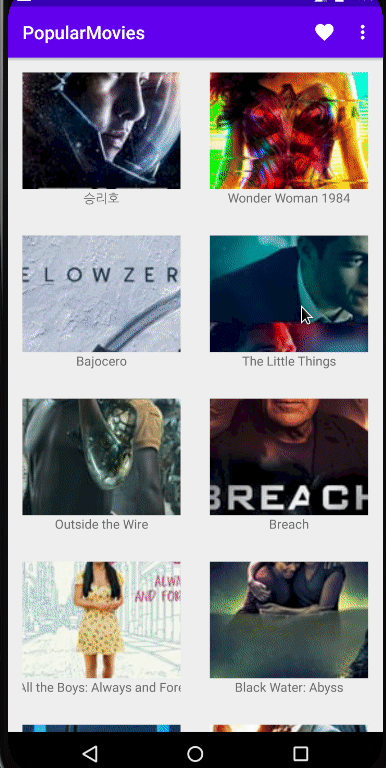

# Popular Movies

Android app that browses themoviedb.org for movie details. Optionally provides ways to sort the movie data and can store favourite movies in a database.

Presents the user with a grid of arranged movie posters upon launch.

## Motivation

Created for personal self-develpment and exploration of design and programming practices for the Android OS.

**Main App Features:**

- Can browse the MovieDB movies in a grid arranged fashion
- Allows the user to specify sort criteria via settings including: top-rated, most popular, now playing and latest
- Presents movie details for any selected movie including: general information, user reviews and trailers
- Let's the user share movie trailers
- Can open movie trailers with the user's specified default app
- Allows the user to favorite the browsing movie
- Contains an activity for viewing favorite movies

Author: Ivo Ganev

6/29/2020